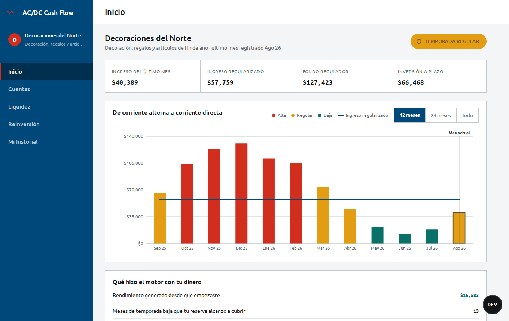
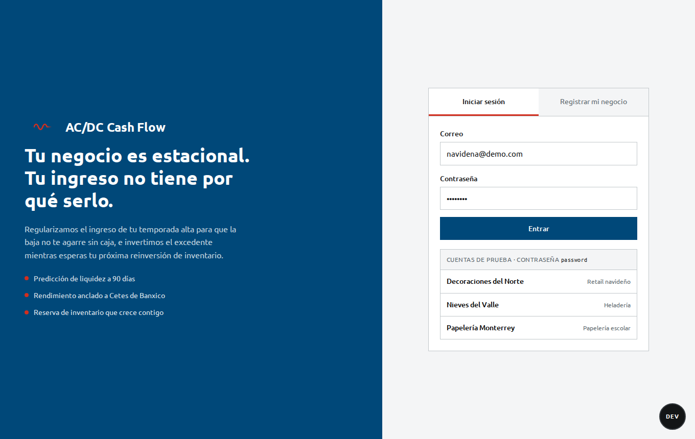
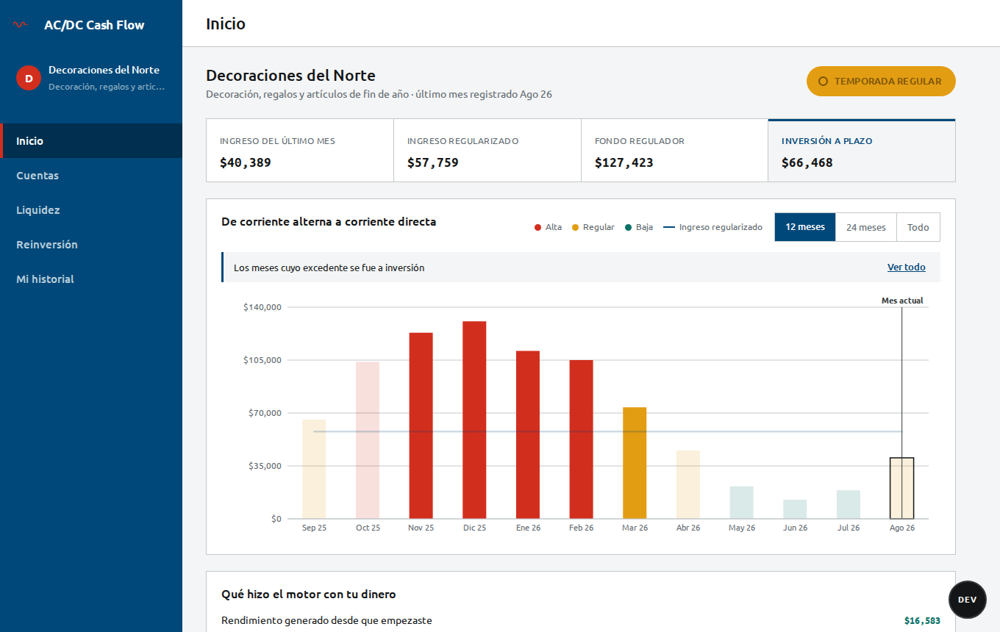
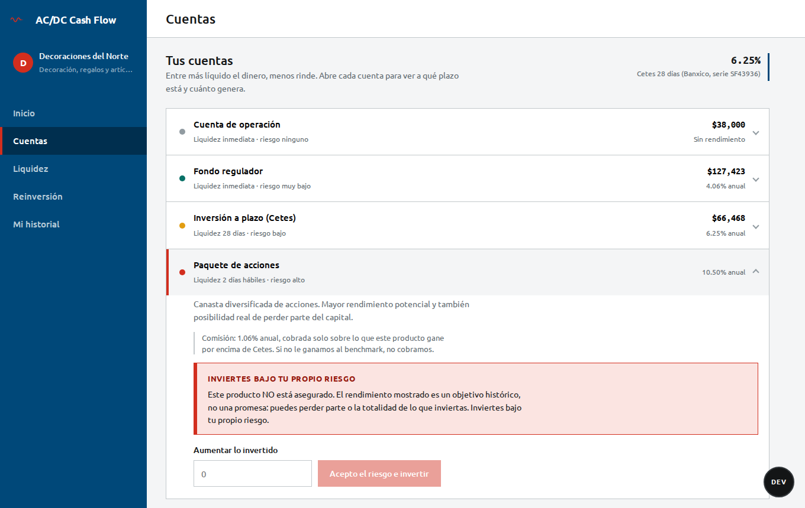
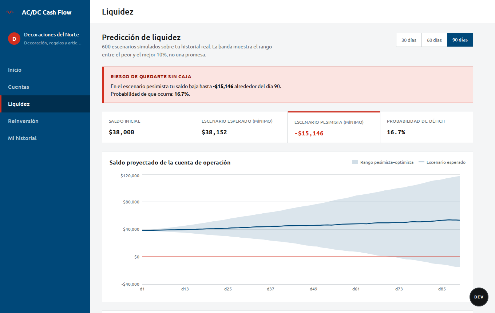
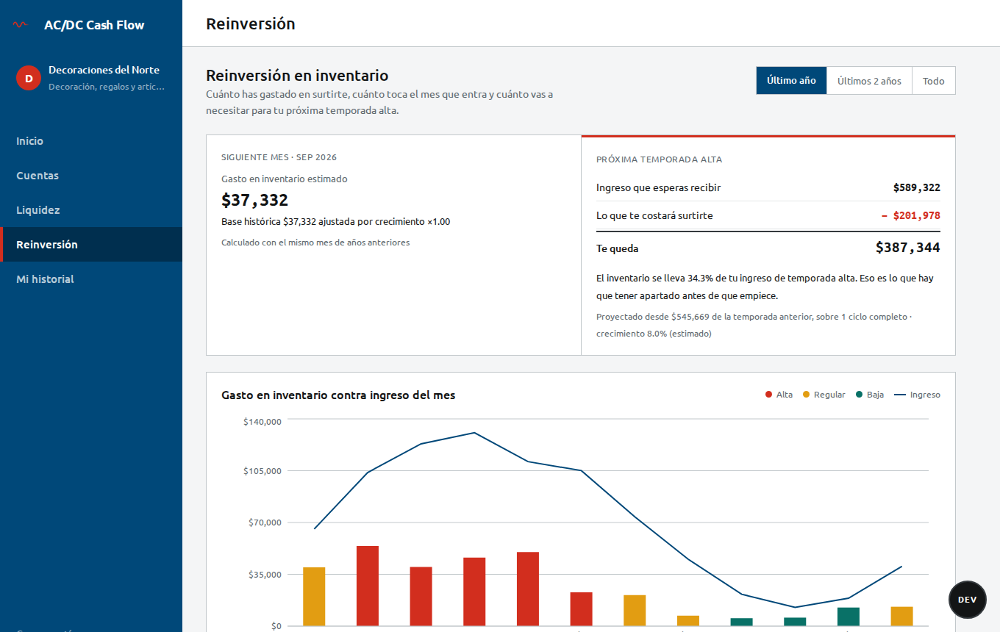
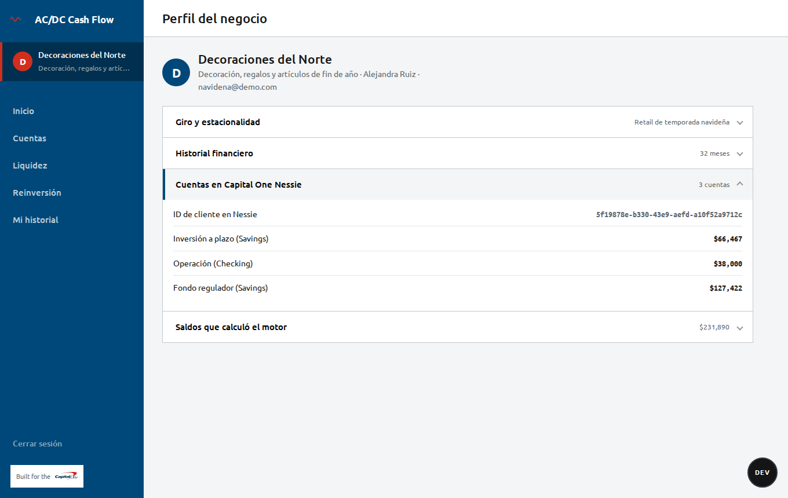
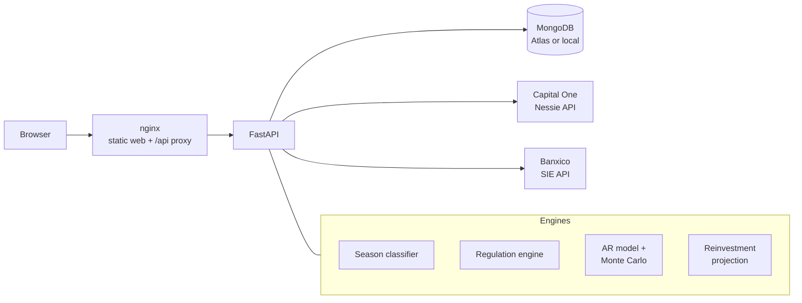

<div align="center">

# AC/DC Cash Flow

**Your business is seasonal. Your income doesn't have to be.**

A treasury platform for seasonal small businesses: it regulates the income of the high season so the low season never runs out of cash, and puts the surplus to work until the next inventory reinvestment.

Built for the **Capital One Challenge · HackMTY 2026** — *SMB Cash-Flow & Working Capital Intelligence (B2B)*

</div>



---

## Contents

- [The problem](#the-problem)
- [What it does](#what-it-does)
- [Screenshots](#screenshots)
- [Try it out](#try-it-out)
- [How it works](#how-it-works)
- [Architecture](#architecture)
- [API reference](#api-reference)
- [Project structure](#project-structure)
- [Troubleshooting](#troubleshooting)
- [Known limitations](#known-limitations)
- [Team](#team)

---

## The problem

A Christmas decorations store can sell $155,000 in December and $21,000 in January. Nothing went wrong — that is simply the shape of the business. But rent, payroll and suppliers don't shrink in January, and next season's inventory has to be bought months before it sells.

Seasonal businesses don't lack revenue. They lack a **regulated** version of it: a steady signal they can plan around, and a clear answer to *how much of this month's money actually belongs to next season*.

The name is literal. **AC** is the alternating current of real seasonal income. **DC** is the direct current a business needs to operate. The platform is the rectifier.

## What it does

| | |
|---|---|
| **Season detection** | Classifies every month as high, regular or low season by statistical deviation against the business's own history. |
| **Income regulation** | Splits cash across three accounts: an operating account, a liquid regulator fund that tops up low-season income, and a term investment that captures high-season surplus. |
| **Real yield** | Anchors every rate to Mexico's live **Cetes 28-day** rate from Banxico. The platform only earns a commission on returns *above* that benchmark. |
| **Liquidity forecast** | Projects 30, 60 or 90 days of cash as a pessimistic / expected / optimistic band built from 600 simulated scenarios — not a single flattering line. |
| **Reinvestment plan** | Estimates next month's inventory spend and the full picture of the next high season: expected income, inventory cost, and what's left. |
| **Real banking backend** | Businesses are provisioned as real customers and accounts in the **Capital One Nessie API**. |
| **Bring your own data** | Upload an income/inventory CSV, or start from an industry seasonality template if you don't have history yet. |

## Screenshots

<table>
  <tr>
    <td width="50%"><br><sub><b>Access.</b> Sign in, or register choosing between uploading your own history or starting from an industry template.</sub></td>
    <td width="50%"><br><sub><b>Linked metrics.</b> Click any metric and the chart highlights exactly the months that explain it.</sub></td>
  </tr>
  <tr>
    <td><br><sub><b>Accounts.</b> Each product with its expected yield. Higher-risk products show an explicit warning before investing more.</sub></td>
    <td><br><sub><b>Liquidity.</b> 90-day forecast band, probability of running out of cash, and the working-capital cushion needed to cover it.</sub></td>
  </tr>
  <tr>
    <td><br><sub><b>Reinvestment.</b> Next month's inventory spend and next high season as income − inventory cost = margin.</sub></td>
    <td><br><sub><b>Profile.</b> Industry, history summary, and the business's live accounts in Capital One Nessie.</sub></td>
  </tr>
</table>

---

## Try it out

### Requirements

- **Docker** with Docker Compose — for the one-command setup
- or **Python 3.11+** and **Node.js 20+** — to run it natively

### 1. Clone and configure

```bash
git clone https://github.com/luiskarloisapunk/hackmty2026-capitalone.git
cd hackmty2026-capitalone

cp .env.example .env
cp backend/.env.example backend/.env
```

Fill in both `.env` files:

| Variable | Required | Where to get it |
|---|---|---|
| `NESSIE_API_KEY` | Yes | [Capital One Nessie](https://nessieisreal.com) — free developer key |
| `NESSIE_BASE_URL` | Yes | Keep `https://api.nessieisreal.com` (HTTPS only — see [Troubleshooting](#troubleshooting)) |
| `JWT_SECRET_KEY` | Yes | `python -c "import secrets; print(secrets.token_hex(32))"` |
| `BANXICO_TOKEN` | Recommended | [Banxico SIE API](https://www.banxico.org.mx/SieAPIRest/service/v1/token) — free token. Without it, a fixed 6.5% fallback rate is used. |
| `MONGODB_URI` | Optional in Docker | A MongoDB Atlas connection string. **Leave it empty and Docker runs its own MongoDB** — no account needed. In native mode, set it to Atlas or to a local MongoDB (`mongodb://localhost:27017`). |

### 2. Run it

**Option A — Docker (recommended)**

```bash
make docker-up
```

Open **http://localhost**. The three demo businesses are seeded automatically on first start.

**Option B — Native, with hot reload**

```bash
make install   # first time only
make seed      # first time only: creates the demo businesses
make dev
```

Open **http://localhost:5173**. API docs at **http://localhost:8000/docs**.

### 3. Sign in

All demo accounts use the password **`password`**:

| Email | Business | Seasonality |
|---|---|---|
| `navidena@demo.com` | Decoraciones del Norte | Christmas retail — peaks Nov–Dec |
| `heladeria@demo.com` | Nieves del Valle | Ice cream — peaks Jun–Aug |
| `papeleria@demo.com` | Papelería Monterrey | School supplies — two peaks, Feb and Aug |

Each one is generated from a different seasonality profile (different phase *and* period), so their charts genuinely look different. The floating **DEV** button in the corner switches between them without logging out.

### All commands

| Command | What it does |
|---|---|
| `make help` | Lists everything below |
| `make docker-up` | Builds and starts the full stack (MongoDB + API + web) |
| `make docker-down` | Stops it |
| `make docker-host` | Same as `docker-up` on the host network — see [Troubleshooting](#troubleshooting) |
| `make docker-logs` | Follows container logs |
| `make docker-check` | Runs the environment diagnostic inside the container |
| `make install` | Installs backend and frontend dependencies |
| `make seed` | Seeds the three demo businesses (idempotent) |
| `make dev` | Runs API and web natively with hot reload |
| `make check` | Runs the environment diagnostic locally |

`make docker-up` and `make dev` free their ports before starting, so switching between the two modes doesn't leave anything stuck.

---

## How it works

### 1. Season classification

For each business, monthly income is compared against the mean $\mu$ and standard deviation $\sigma$ of its own history:

$$
\text{season}(m) =
\begin{cases}
\text{high} & \text{if } m > \mu + k\sigma \\
\text{low} & \text{if } m < \mu - k\sigma \\
\text{regular} & \text{otherwise}
\end{cases}
\qquad k = 0.5
$$

The regulated income target is the mean of the months classified *regular* — not the overall mean, which high and low seasons distort.

### 2. Income regulation

Month by month, the engine moves money between accounts:

- **High season:** the surplus above the target first fills the liquid regulator fund up to its goal (three months of low-season shortfall plus next month's inventory). The rest goes to the term investment.
- **Low season:** the shortfall is covered from the regulator fund, and from the investment only if the fund runs dry.
- **Rebalancing:** after each month, the regulator fund is topped back up from the investment, so the business never enters a new season without liquidity.

### 3. Liquidity forecast

The forecasting engine fits an autoregressive model on daily net cash flow, solved by least squares through SVD:

$$
\hat{y}_{t+1} = \beta_0 + \sum_{i=1}^{p} \beta_i \, y_{t-i+1},
\qquad
\beta^{*} = \arg\min_{\beta} \lVert A\beta - b \rVert^2 = A^{+} b
$$

An AR model iterated forward converges to its own mean, so a single point forecast flattens out and its cumulative curve becomes a near-perfect straight line — we measured $R^2 = 0.9993$ against a line on our first version. Instead, the engine runs **600 Monte Carlo trajectories**, each step adding a residual $\varepsilon$ resampled from the model's real historical errors:

$$
\tilde{y}^{(k)}_{t+1} = \beta_0 + \sum_{i=1}^{p} \beta_i \, \tilde{y}^{(k)}_{t-i+1} + \varepsilon^{(k)}_{t+1},
\qquad \varepsilon^{(k)}_{t+1} \sim \text{Bootstrap}(\hat{\varepsilon})
$$

The 10th, 50th and 90th percentiles of those trajectories become the pessimistic, expected and optimistic bands. When the pessimistic band goes negative, the working-capital advisor computes the principal needed today to cover it:

$$
P = \frac{D}{(1 + r/n)^{nt}}
$$

### 4. Reinvestment projection

The next high season is projected from the historical ratio between inventory spend and high-season income, scaled by year-over-year growth. Only **complete** seasons are compared: a season cut off by the edge of the history would invent a false decline.

### 5. Products and commission

| Product | Liquidity | Risk | Expected yield |
|---|---|---|---|
| Operating account | Immediate | None | 0% |
| Regulator fund | Immediate | Very low | 0.65 × Cetes |
| Term investment | 28 days | Low | 1.00 × Cetes |
| Equity basket | 2 business days | High | 1.85 × Cetes *(target, not guaranteed)* |

The platform only charges on the *alpha* — what a product earns above the risk-free benchmark:

$$
\text{commission} = \gamma \cdot \max(r_{\text{product}} - r_{\text{Cetes}},\ 0), \qquad \gamma = 0.20
$$

If a product doesn't beat Cetes, there is no commission.

---

## Architecture



| Layer | Technology |
|---|---|
| Frontend | React 19, Vite, Recharts |
| Backend | Python 3.11, FastAPI, Uvicorn, Pydantic |
| Math | NumPy (AR model, SVD, Monte Carlo), Pandas (CSV ingestion) |
| Data | MongoDB Atlas via Motor (async) |
| Auth | JWT (PyJWT) + bcrypt |
| External APIs | Capital One Nessie, Banxico SIE |
| Infrastructure | Docker Compose, nginx |

## API reference

Interactive docs are served at **`/docs`** when the backend is running. Main endpoints:

| Method | Endpoint | Description |
|---|---|---|
| `POST` | `/api/auth/registro` | Register a user and their business |
| `POST` | `/api/auth/login` | Sign in, returns a JWT |
| `GET` | `/api/auth/me` | Current user |
| `GET` | `/api/negocios/mio/panorama` | Seasons, account balances and products |
| `POST` | `/api/negocios/mio/liquidez` | Liquidity forecast (15–180 days) |
| `GET` | `/api/negocios/mio/reinversion` | Reinvestment plan |
| `GET` | `/api/negocios/mio/perfil` | Business profile and Nessie status |
| `POST` | `/api/negocios/mio/nessie/vincular` | Provision the business in Nessie (idempotent) |
| `POST` | `/api/negocios/mio/historial-csv` | Upload financial history CSV |
| `GET` | `/api/negocios/plantilla-csv` | Download the CSV template |
| `GET` | `/api/negocios/plantillas` | Industry seasonality templates |
| `GET` | `/api/negocios/productos` | Products with their current yield |
| `POST` | `/api/temporadas/analizar` | Classify an arbitrary monthly history |
| `POST` | `/api/treasury/analyze` | Raw AR forecast over Nessie-style transactions |

Endpoints under `/api/negocios/mio/*` require `Authorization: Bearer <token>`.

### CSV format

```csv
fecha,ingreso,gasto_inventario
2025-01,48000,15200
2025-02,51500,16800
```

One row per month, at least 3 months. `fecha` is `YYYY-MM`; `ingreso` is monthly income; `gasto_inventario` is monthly inventory spend.

## Project structure

```
.
├── backend/
│   ├── app/
│   │   ├── modelo/          AR engine (SVD), Monte Carlo simulation, working-capital advisor
│   │   ├── routers/         auth, negocios, temporadas, treasury, customers, accounts
│   │   ├── services/        season classifier, regulation engine, liquidity, reinvestment,
│   │   │                    products, Nessie and Banxico clients, data generators
│   │   └── main.py
│   ├── seed_demo.py         demo businesses
│   ├── diagnostico.py       environment diagnostic
│   └── Dockerfile
├── frontend/
│   ├── src/components/      login, home, accounts, liquidity, reinvestment, profile, history
│   ├── nginx.conf.template
│   └── Dockerfile
├── docker-compose.yml       standard stack
├── docker-compose.host.yml  host-network override
└── Makefile
```

> The source code, comments and UI are in Spanish; this README is in English.

---

## Troubleshooting

Run the diagnostic first — it checks every variable and external service and tells you exactly what to change:

```bash
make check          # native
make docker-check   # inside the container
```

**The client list is empty or Nessie doesn't respond.** Nessie only answers over **HTTPS**; plain HTTP connections hang. The old `api.reimaginebanking.com` domain no longer resolves. Use `NESSIE_BASE_URL=https://api.nessieisreal.com`.

**Containers start but login hangs or returns 504.** Some environments (GitHub Codespaces, several Docker-in-Docker setups) filter traffic between containers on the bridge network: DNS resolves, but TCP never connects. On Linux, `make docker-up` already uses the host network to avoid this. If you need to force it, run `make docker-host`.

**`address already in use`.** Another instance is holding port 8000, 5173 or 80. `make dev` and `make docker-up` free those ports automatically; if you started things manually, run `make docker-down`.

**Data registered in one mode doesn't show up in the other.** Check which database you're on — `make check` prints it. With `MONGODB_URI` set, both modes share Atlas; without it, Docker uses its own local MongoDB.

## Known limitations

This is a hackathon prototype, and we'd rather state its limits than have them discovered:

- **Demo data is synthetic.** The three businesses come from seasonality templates. The CSV upload works with real data, but no real business has been piloted yet.
- **The equity basket's 1.85× yield is a placeholder**, not a backtested figure.
- **No money moves.** Balances are the output of the regulation engine; Nessie accounts are created with those balances, but there are no real transfers or investments.
- **Operating the investment products for real** would require a licensed fund manager partner — the platform is not a regulated entity.
- **Nessie has no investment account type** (only `Checking`, `Savings`, `Credit Card`), so investment accounts are created as `Savings` and distinguished by nickname.

## Team

Built by a team of four at **HackMTY 2026**, with Claude Code as a pair-programming partner throughout development.

Made for the **Capital One Challenge** using the [Nessie API](https://nessieisreal.com).
